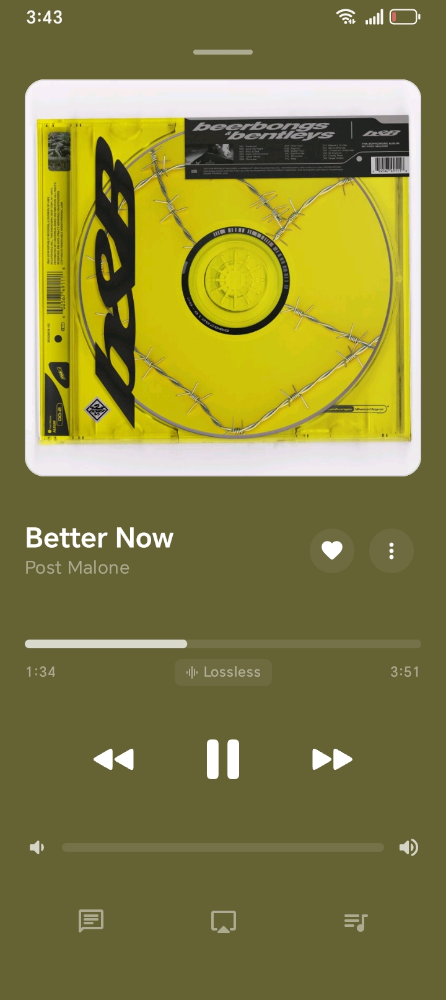
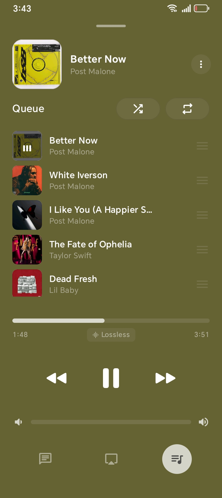
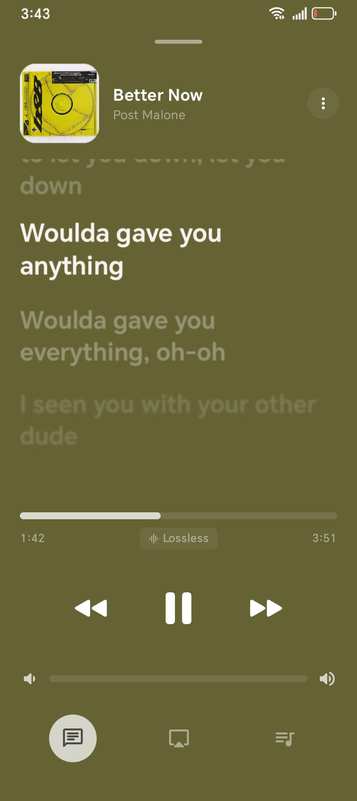
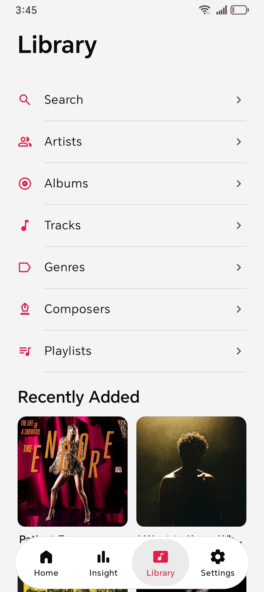
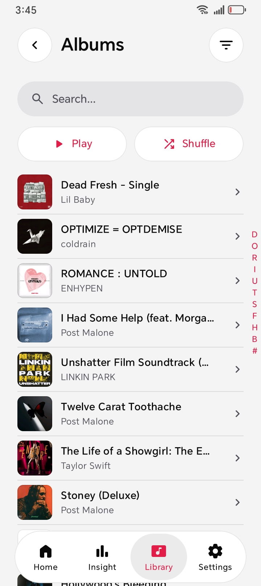
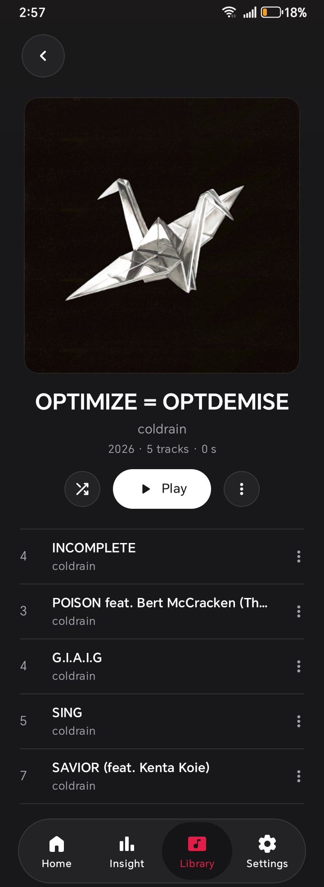
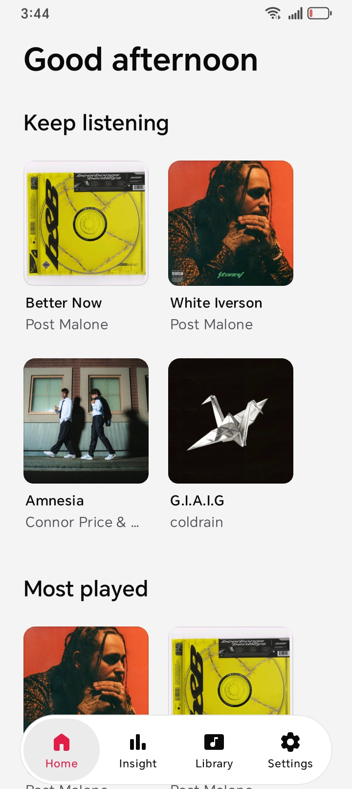

<h1 align="center">Tune</h1>

<b>An Apple Music-inspired local music player for Android.</b> Your files, your library, nothing else.

<a href="#download">Download</a> ·
<a href="#features">Features</a> ·
<a href="#screenshots">Screenshots</a> ·
<a href="#building">Building</a> ·
<a href="#license">License</a>

> [!IMPORTANT]
> Tune is not affiliated with, endorsed by, or connected to Apple Inc. in
> any way. It plays music files stored on your own device — there is no
> account, no streaming service, no sync, and no advertising or analytics.

## Screenshots

| Now playing | Queue |
| ----------- | ----- |
|  |  |

| Lyrics | Library |
| ------ | ------- |
|  |  |

| Albums | Album details |
| ------ | ------------- |
|  |  |

| Home |
| ---- |
|  |

## Features

**Playback**
- Play queue with play next, append, remove, reorder, and clear.
- Shuffle and repeat (off, one, all), favorites with a dedicated playlist.
- Mini player and fullscreen player with seek, volume, and quality badge.

**Library**
- Scans the audio files on your device with an explicit permission
  request; browse and search tracks, artists, albums, genres, composers,
  and playlists, plus recently-added and detail pages.
- Album art from embedded files with track-art fallback; custom playlist
  covers and artist pictures picked from your device.

**Audio**
- Embedded FFmpeg decoding: FLAC, MP3, M4A/AAC, OGG Vorbis, Opus, WAV,
  AIFF, APE, WavPack, DSF/DFF, WMA, and more.
- 10-band equalizer with presets, volume normalization, crossfade up to
  12 seconds, and automatic gapless transitions.
- Lossy / Lossless / Hi-Res / DSD quality badges.

**Lyrics**
- Synced and plain lyrics from lrclib and Kugou, with a built-in finder
  for songs that share a title.
- Offline romanization for Chinese and Korean lyrics.

**Experience**
- Frosted-glass Apple Music-style interface with system, light, and dark
  themes, edge-to-edge layout, and a reduce-transparency option.
- Interface in 12 languages; Last.fm scrobbling; in-app updates that
  pick the build matching your device; fully offline-capable library
  and playback.

## Download

Grab the APK for your device from the
[Releases page](https://github.com/Exodi-dio/tune/releases/latest) —
`Tune-v1.0.0.apk` works everywhere, or pick your architecture build.
Sideloading asks you to allow installs once; afterwards the app updates
itself from Settings → About. Requires Android 12 or newer.

## Building

All builds, tests, and verification run in GitHub Actions — nothing in
this project is built on a developer machine. See
[.github/workflows](.github/workflows) and [AGENTS.md](AGENTS.md).

## Acknowledgments

Tune's interface is built around the [Airmedy](https://github.com/misa198/airmedy)
design language by [misa198](https://github.com/misa198). Airmedy is
GPL-3.0 software; further provenance is recorded in [NOTICE](NOTICE).

## License

This project is licensed under the **GNU General Public License v3.0
(GPLv3)**. See the [LICENSE](LICENSE) file for details.

